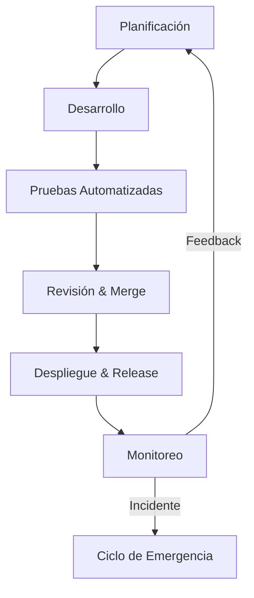

# Diseño de Pipeline de Ingeniería Agéntica (Agentic Engineering Pipeline)

Este documento detalla el diseño de un pipeline de desarrollo de software completamente autónomo y colaborativo, gestionado por un equipo de agentes de Inteligencia Artificial. El objetivo es asegurar que solo código robusto y testado llegue a producción, minimizando la intervención humana y maximizando la eficiencia.

## 1. Arquitectura de Agentes (The AI Squad)

El sistema está orquestado por 6 agentes especializados que colaboran entre sí:

1.  **Agent-PM (Planificador):** Responsable de la estrategia, desglose de tareas y priorización.
2.  **Agent-Dev (Desarrollador):** Escribe el código productivo y realiza refactorizaciones.
3.  **Agent-QA (Tester):** Diseña y ejecuta pruebas, asegura la calidad y cobertura.
4.  **Agent-Auditor (Reviewer):** Revisa el código, seguridad y cumplimiento de estándares.
5.  **Agent-Ops (Deployer):** Gestiona la infraestructura, despliegues y versiones.
6.  **Agent-Medic (Hotfixer):** Monitorea producción y responde a incidentes críticos.

---

## 2. Flujo de Trabajo del Pipeline

---

## 3. Etapas del Pipeline y Terminología

### Etapa 1: Planificación y Estrategia
El **Agent-PM** analiza los requerimientos de alto nivel y los organiza.
*   Las funcionalidades grandes se agrupan en un **Epic** (e.g., "Sistema de Autenticación"), que luego se desglosa en historias de usuario más pequeñas.
*   Para cada historia, el agente asigna un **Story point** basándose en la complejidad histórica, permitiendo estimar la velocidad del equipo.
*   Si una tarea tiene alta incertidumbre tecnológica, el Agent-PM solicita un **Spike** al Agent-Dev: una investigación rápida time-boxed para entender la viabilidad antes de comprometerse al desarrollo completo.

### Etapa 2: Desarrollo
El **Agent-Dev** toma las tareas del backlog y comienza la codificación.
*   Dependiendo de la naturaleza de la tarea, el trabajo se clasifica como:
    *   **Feature:** Nueva funcionalidad que aporta valor directo al usuario.
    *   **Bug fix:** Corrección de un error detectado durante el desarrollo no productivo.
    *   **Chore:** Tarea rutinaria de mantenimiento (e.g., actualizar librerías) que no altera el producto funcionalmente.
    *   **Refactor:** Mejora de la estructura interna del código para aumentar la legibilidad sin cambiar su comportamiento externo.
*   El agente es consciente de la **Tech debt** (Deuda técnica); si detecta que una solución rápida hoy complicará el futuro, crea tickets automáticos en el backlog para pagarla más adelante.
*   Si un cambio implica modificar contratos de API existentes de forma incompatible, se marca explícitamente como un **Breaking change** para alertar al Agent-Ops y a los consumidores de la API.

### Etapa 3: Aseguramiento de Calidad (Testing)
El **Agent-QA** entra en acción cada vez que el Agent-Dev propone cambios. Su objetivo es cumplir estrictamente la **Definition of Done (DoD)**.
*   Primero, se ejecuta **Linting** para asegurar que el código cumpla con las guías de estilo (formato, indentación) y no tenga errores sintácticos obvios.
*   A continuación, se ejecutan las baterías de pruebas jerárquicas:
    *   **Unit test:** Verifican funciones o clases aisladas.
    *   **Integration test:** Comprueban que los módulos interactúen correctamente entre sí (e.g., API con Base de Datos).
    *   **E2E test** (End-to-End): Simulan un usuario real navegando por el sistema completo.
*   El agente verifica el **Coverage**, rechazando cualquier entrega que no alcance el umbral definido (e.g., 90% de líneas cubiertas).
*   También monitorea la existencia de algún **Flaky test** (prueba inestable que falla aleatoriamente) y lo aísla para reparación inmediata, evitando falsos negativos en el pipeline.

### Etapa 4: Revisión e Integración
Una vez las pruebas pasan en local, el código avanza.
*   El Agent-Dev envía sus cambios empaquetados mediante **Conventional Commits** (e.g., `feat: user login`, `fix: token expiry`), lo que permitirá automatizar el versionado más tarde.
*   Se abre una **PR (Pull Request)** / **MR (Merge Request)** contra la rama principal.
*   El **Agent-Auditor** realiza un **Code review** exhaustivo. No solo mira la lógica, sino también seguridad y performance. Si encuentra problemas, solicita cambios al Agent-Dev; si todo está correcto, aprueba la fusión.

### Etapa 5: Despliegue y Entrega
El **Agent-Ops** toma el control tras la aprobación.
*   Inicia el pipeline de **CI/CD** (Continuous Integration / Continuous Delivery). El servidor de CI vuelve a ejecutar todas las pruebas y construye los artefactos de despliegue.
*   Basándose en los mensajes estructurados, el agente determina automáticamente el **Bump version** semántico (Patch para correcciones, Minor para novedades, Major para cambios incompatibles).
*   Genera un **Changelog** automático listando qué ha cambiado en esta versión para los humanos.
*   Finalmente, ejecuta la **Release** a producción, haciendo accesible la nueva versión a los usuarios finales.

### Etapa 6: Mantenimiento y Emergencias
El **Agent-Medic** vigila la salud del sistema en vivo.
*   Si detecta un error crítico en producción que afecta a los usuarios, inicia un procedimiento de **Hotfix**. Este es un parche urgente que puede "saltarse" pasos burocráticos del flujo normal (nunca los tests críticos) para restaurar el servicio lo antes posible.

---

## 4. Ejemplo de Flujo: Funcionalidad Nueva vs. Corrección Urgente

| Paso | Flujo de Nueva Funcionalidad | Flujo de Emergencia |
| :--- | :--- | :--- |
| **Origen** | Agent-PM prioriza una iniciativa. | Agent-Medic detecta caída en producción. |
| **Desarrollo** | Agent-Dev crea rama `dev/`. | Agent-Dev crea rama `fix/`. |
| **Testing** | Ciclo completo (Batería total). | Tests críticos + Reproducción del error. |
| **Review** | Revisión profunda por Agent-Auditor. | Revisión "Fast-track" (énfasis en seguridad). |
| **Deploy** | Publicación programada vía Pipeline. | Despliegue inmediato tras pase de tests. |
| **Versión** | Subida Minor (e.g., 1.2.0 -> 1.3.0). | Subida Patch (e.g., 1.2.0 -> 1.2.1). |

## 5. Beneficios de este Modelo Agentic
*   **Trazabilidad Total:** Gracias a mensajes estandarizados y registros automáticos.
*   **Calidad Garantizada:** Nada llega a producción sin cumplir los criterios de calidad y pruebas.
*   **Deuda Controlada:** La gestión proactiva de riesgos técnicos y mejoras asegura longevidad.
*   **Resiliencia:** Manejo autónomo de inestabilidades y parches de emergencia.
